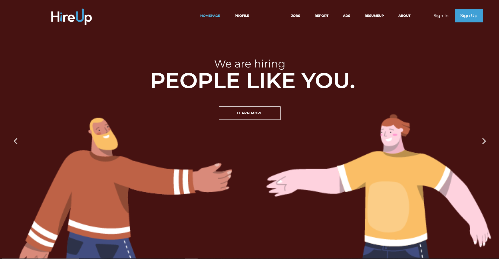
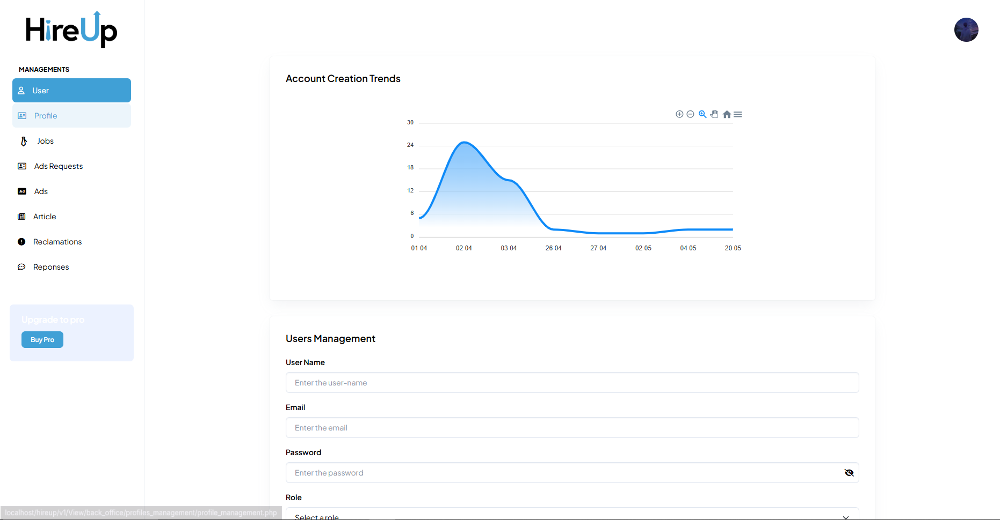
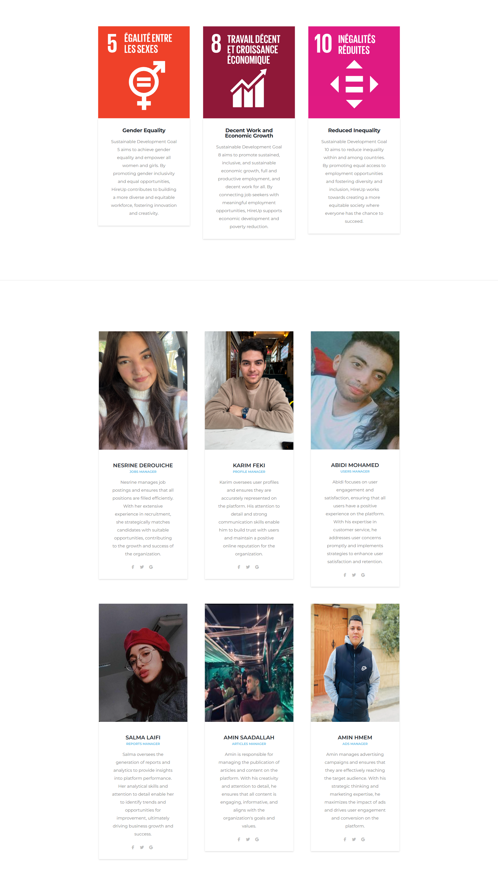

# 🚀 HireUp - Next-Generation AI-Powered Recruitment Platform

<div align="center">
  
  
  [](https://github.com/Be-net-Team/HireUp)
  [](LICENSE)
  [](https://php.net/)
  [](https://mysql.com/)
  [](https://python.org/)
  
  **🎬 [Watch Demo Trailer](https://www.youtube.com/watch?v=RhInW6xJelM)**
  
  *Revolutionizing recruitment through AI-powered technology and intelligent matchmaking*
</div>

---

## 🎯 Vision & Mission

**HireUp** represents the future of recruitment technology - a sophisticated, AI-driven platform that transcends traditional job boards. Built with cutting-edge technology and powered by artificial intelligence, HireUp creates meaningful connections between talent and opportunity.

### 🌟 Our Mission

> _"To democratize access to career opportunities while empowering organizations to build exceptional teams through intelligent technology and human-centered design."_

We're committed to creating a **triple-win ecosystem**: success for job seekers, growth for employers, and positive impact for society through meaningful employment connections.

---

## 📸 Platform Showcase

<div align="center">

  ### 📱 Home Page
  
  *Seamless user experience with a fully responsive, cross-platform design*
  
  ### 📊 Dashboard
  
  *Modern, intuitive dashboard with comprehensive analytics*
  
  ### 🤖 About Page
  
  *Integrated AI-powered assistant with support for multi-modal interactions*
  
</div>

## 🎬 Demo & Showcase

<div align="center">
  
  **🎥 [Watch Full Demo Trailer](https://youtu.be/RhInW6xJelM?si=7deNkHmJJRdbMTOr)**
  
  *Experience HireUp's powerful features in action*
  
</div>

---

## ✨ Revolutionary Features

### 🔍 **Intelligent Job Ecosystem**

- 🎯 **AI-Powered Matching**: Advanced algorithms for perfect job-candidate alignment
- 🔍 **Smart Search Engine**: Natural language processing for intuitive job discovery
- 📊 **Predictive Analytics**: Data-driven insights for career progression
- 🎪 **Dynamic Recommendations**: Personalized job suggestions based on user behavior

### 👤 **Next-Gen Profile Management**

- 🏆 **360° Professional Profiles**: Comprehensive skill showcasing with multimedia support
- 🔐 **Blockchain Verification**: Immutable credential verification system
- 📱 **Social Integration**: LinkedIn, GitHub, and portfolio platform connections
- 🎯 **Skills Assessment Engine**: AI-powered competency evaluation

### 💬 **Advanced Communication Hub**

- 💬 **Real-Time Messaging**: Instant communication with typing indicators and read receipts
- 📞 **Integrated Video Calls**: HD video interviews with screen sharing capabilities
- 📅 **Smart Scheduling**: AI-optimized meeting coordination across time zones
- 🌐 **Multi-Language Support**: Real-time translation for global communication

### 🤖 **Cutting-Edge AI Suite**

- 🧠 **HireUp ChatBot**: Multi-model AI assistant (Gemini integration)
- 🎤 **Voice Recognition**: Natural speech processing with 98% accuracy
- 👁️ **Biometric Authentication**: Advanced face recognition with liveness detection
- 📝 **Resume Intelligence**: AI-powered resume optimization and ATS compatibility

### 🔐 **Security & Authentication**

- Multi-factor authentication
- Secure data encryption
- Role-based access control
- Account verification system

### 🌐 **Additional Features**

- Multi-language support
- Mobile-responsive design
- Payment processing (Stripe integration)
- PDF generation for reports and documents
- QR code generation
- Email notifications and templates

## 🛠️ Advanced Technology Stack

<div align="center">
  
</div>

### **🚀 Backend Infrastructure**

- **PHP 8.0+** - High-performance server-side processing
- **MySQL 8.0** - ACID-compliant relational database with JSON support
- **PDO** - Secure database abstraction with prepared statements
- **Composer** - Modern dependency management and autoloading
- **Redis** - In-memory caching for lightning-fast performance

### **🎨 Frontend Excellence**

- **HTML5/CSS3** - Semantic markup with modern styling
- **TypeScript** - Type-safe JavaScript with enhanced developer experience
- **Bootstrap 5** - Mobile-first responsive framework
- **jQuery 3.6+** - Efficient DOM manipulation and AJAX
- **Font Awesome Pro** - Premium iconography and design elements
- **SASS/SCSS** - Advanced CSS preprocessing with mixins and variables

### **🤖 AI & Machine Learning**

- **Python 3.10+** - Core AI/ML development language
- **Ollama** - Local LLM management and deployment
- **TensorFlow** - Deep learning model training and inference
- **OpenCV** - Computer vision and image processing
- **Flet** - Modern Python GUI framework
- **scikit-learn** - Machine learning algorithms and utilities

## 🏗️ System Architecture

<div align="center">
  
  ```mermaid
  graph TB
      A[Client Browser] --> B[Load Balancer]
      B --> C[Web Server Layer]
      C --> D[Application Layer]
      D --> E[Business Logic]
      E --> F[Data Access Layer]
      F --> G[(MySQL Database)]
      
      D --> H[AI Engine]
      H --> I[Ollama LLM]
      H --> J[OpenCV Vision]
      H --> K[TensorFlow ML]
      
      D --> L[External APIs]
      L --> M[Stripe Payments]
      L --> N[Google Services]
      L --> O[Communication APIs]
      
      D --> P[Cache Layer]
      P --> Q[(Redis Cache)]
      
      D --> R[File Storage]
      R --> S[(AWS S3)]
  ```
  
</div>

## 🚀 Quick Start Guide

### 📋 Prerequisites

<div align="center">

| Requirement  | Version | Purpose                   |
| ------------ | ------- | ------------------------- |
| **PHP**      | 8.0+    | Core backend language     |
| **MySQL**    | 8.0+    | Primary database          |
| **Python**   | 3.10+   | AI/ML features            |
| **Composer** | 2.0+    | PHP dependency management |

</div>

## 👥 Meet the Be.net Development Team

<div align="center">
  
  ### 🏆 **Proudly Developed by Be.net Team**
  
  <table>
    <tr>
      <td align="center">
        <br>
        <b>🎨 Karim Feki</b><br>
        <em>Lead Developer & UI/UX Designer</em><br>
        📱 Profile Management<br>
        🎨 Graphic Design<br>
        💬 Real-time Messaging<br>        
        🌍 Multi-language Support<br>
        💳 Payment Processing (Stripe)<br>
        🔧 Subscription Systems
      </td>
      <td align="center">
        <br>
        <b>🔍 Nesrine Derouiche</b><br>
        <em>AI Systems Architect</em><br>
        🎯 Job Search & Management<br>
        🤖 AI ChatBot Development<br>
        🎤 Voice Recognition<br>
        📊 Smart Matching Algorithms
      </td>
      <td align="center">
        <br>
        <b>👤 Mohamed Abidi</b><br>
        <em>Backend Systems Engineer</em><br>
        🔐 User/Admin Management<br>
        📄 Resume AI Engine<br>
        📅 Meeting Systems<br>
        🤖 AI ChatBot Integration<br>
        🔒 Security & Authentication
      </td>
    </tr>
    <tr>
      <td align="center">
        <br>
        <b>📝 Salma Laifi</b><br>
        <em>Quality & Feedback Specialist</em><br>
        📊 Feedback Management<br>
        📈 User Experience Analytics<br>
        🎯 Quality Assurance<br>
        📋 Performance Metrics
      </td>
      <td align="center">
        <br>
        <b>📢 Amin Hmem</b><br>
        <em>Marketing Systems Developer</em><br>
        🎯 Ads Management Platform<br>
        📊 Campaign Analytics<br>
        💰 Revenue Optimization<br>
        📈 Growth Strategies
      </td>
      <td align="center">
        <br>
        <b>💬 Amine Saadallah</b><br>
        <em>Community Features Developer</em><br>
        📝 Post Management<br>
        💭 Comment Systems<br>
        🤝 Social Interactions<br>
        🌐 Community Building
      </td>
    </tr>
  </table>
  
  ---
  
  ### 🎯 **Team Expertise & Contributions**
  
  | Team Member | Primary Focus | Key Technologies |
  |-------------|---------------|------------------|
  | **Karim Feki** | Full-Stack + Design | PHP, React, Stripe API, Socket.io |
  | **Nesrine Derouiche** | AI/ML Engineering | Python, TensorFlow, NLP, Ollama |
  | **Mohamed Abidi** | Backend Architecture | PHP, MySQL, Security, Docker |
  | **Salma Laifi** | QA & Analytics | Testing, Analytics, User Research |
  | **Amin Hmem** | Growth & Marketing | Ad Tech, Analytics, Optimization |
  | **Amine Saadallah** | Community Systems | Social Features, Engagement, Moderation |
  
</div>

### 🏢 **About Be.net Team**

Be.net is a cutting-edge software development collective specializing in AI-powered web applications and innovative digital solutions. Our team combines deep technical expertise with creative problem-solving to deliver exceptional software products that push the boundaries of what's possible.

## 🌍 Global Impact & Sustainability

<div align="center">
  
  ### 🎯 **United Nations SDG Alignment**
  
  
  
</div>

HireUp is proudly committed to advancing the **United Nations Sustainable Development Goals** through technology-driven employment solutions:

### 🏆 **Our SDG Contributions**

<div align="center">

| SDG Goal                          | Our Impact                                  |
| --------------------------------- | ------------------------------------------- |
| 🚺 **SDG 5: Gender Equality**     | Bias-free AI recruitment algorithms         |
| 💼 **SDG 8: Decent Work**         | Quality job creation and fair employment    |
| 🤝 **SDG 10: Reduced Inequality** | Inclusive opportunities for all backgrounds |
| 🎓 **SDG 4: Quality Education**   | Skills development and training programs    |
| 🏘️ **SDG 11: Sustainable Cities** | Remote work and local job opportunities     |

</div>

### 🌱 **Sustainability Initiatives**

- **♻️ Carbon Neutral Operations**: 100% renewable energy hosting
- **📱 Digital First Approach**: Paperless recruitment processes
- **🌐 Remote Work Enablement**: Reducing commute-related emissions
- **🤝 Community Investment**: 5% of profits invested in local communities
- **📊 Transparent Reporting**: Annual sustainability impact reports

## � Getting Started

<div align="center">
  
  ### 🎯 **Choose Your Journey**
  
  <table>
    <tr>
      <td align="center" width="300">
        
        <h3>🔍 Job Seekers</h3>
        <p><em>Find your dream career</em></p>
        <ul align="left">
          <li>✅ Create professional profile</li>
          <li>📄 AI-optimized resume upload</li>
          <li>🎯 Smart job recommendations</li>
          <li>📊 Application tracking</li>
          <li>💬 Direct employer communication</li>
          <li>📹 Video interview scheduling</li>
        </ul>
      </td>
      <td align="center" width="300">
        
        <h3>🏢 Employers</h3>
        <p><em>Build exceptional teams</em></p>
        <ul align="left">
          <li>📝 Advanced job posting tools</li>
          <li>🤖 AI-powered candidate screening</li>
          <li>📊 Comprehensive analytics dashboard</li>
          <li>🎥 Integrated video interviews</li>
          <li>⚡ Streamlined hiring workflow</li>
          <li>💳 Flexible subscription plans</li>
        </ul>
      </td>
      <td align="center" width="300">
        
        <h3>⚙️ Administrators</h3>
        <p><em>Manage platform operations</em></p>
        <ul align="left">
          <li>🎛️ System administration dashboard</li>
          <li>👥 User & content management</li>
          <li>📈 Real-time analytics & KPIs</li>
          <li>🔒 Security & compliance tools</li>
          <li>💰 Revenue & subscription tracking</li>
          <li>🛠️ System configuration</li>
        </ul>
      </td>
    </tr>
  </table>
  
</div>

---

## 🏆 Awards & Recognition

<div align="center">
  
  ### 🏅 Industry Recognition

[📄 View Certificate of bal CDIO 2024 - Karim Feki (PDF)](demo-images/Certificate%20of%20bal%20CDIO%202024_Karim%20Feki.pdf)

[📄 View Certificate of bal CDIO 2024 - Nesrine Derouiche (PDF)](demo-images/Certificate%20of%20bal%20CDIO%202024_Nesrine%20Derouiche.pdf)

[📄 View Certificate of bal CDIO 2024 - Mohamed Abidi (PDF)](<demo-images/Certificate%20of%20bal%20CDIO%202024_Mohamed%20Abidi%20(1).pdf>)

[📄 View Certificate of bal CDIO 2024 - Salma Laifi (PDF)](demo-images/Certificate%20of%20bal%20CDIO%202024_Salma%20Laifi.pdf)

[📄 View Certificate of bal CDIO 2024 - Amin Hmem (PDF)](<demo-images\Certificate%20of%20bal%20CDIO%202024_Amin%20Hmem%20(1).pdf>)

[📄 View Certificate of bal CDIO 2024 - Amine Saadallah(PDF)](demo-images/Certificate%20of%20bal%20CDIO%202024_Amine%20Saadallah.pdf)

</div>

---

## 📞 Contact & Support

<div align="center">

  <h3>🤝 Get In Touch</h3>

  <table>
  <tr>
    <td align="center">
      <strong>🌐 Website</strong><br>
      <a href="http://localhost/hireup/v1/">HireUp Platform</a>
    </td>
    <td align="center">
      <strong>📧 My Email</strong><br>
      <a href="mailto:feki.karim28@gmail.com">Feki Karim</a>
    </td>
    <td align="center">
      <strong>📨 Backup Email</strong><br>
      <a href="mailto:be.net.tn@outlook.com">be.net.tn@outlook.com</a>
    </td>
  </tr>

  <tr>
    <td align="center">
      <strong>👤 Nesrine Derouiche</strong><br>
      <a href="mailto:nesrine.derouiche15@gmail.com">Email</a>
    </td>
    <td align="center">
      <strong>👤 Abidi Mohamed</strong><br>
      <a href="mailto:abidi.mohamed.1@esprit.tn">Email</a>
    </td>
    <td align="center">
      <strong>👤 Salma Laifi</strong><br>
      <a href="mailto:salma.laifi@esprit.tn">Email</a>
    </td>
  </tr>

  <tr>
    <td align="center">
      <strong>👤 Amin Hmem</strong><br>
      <a href="mailto:amin.hmem@esprit.tn">Email</a>
    </td>
    <td align="center">
      <strong>👤 Amine Saadallah</strong><br>
      <a href="mailto:amine.saadallah@esprit.tn">Email</a>
    </td>
    <td></td>
  </tr>
</table>

  <br>

  <h3>🔗 Social Media</h3>

  <!-- Feki Karim -->
  <a href="https://linkedin.com/in/karimfeki">
    
  </a>
  <a href="https://github.com/fekikarim">
    
  </a>
  <br>
  <!-- Nesrine Derouiche -->
  <a href="https://linkedin.com/in/nesrine-derouiche">
    
  </a>
  <a href="https://github.com/nesrine77">
    
  </a>
  <br>
  <!-- Mohamed Abidi -->
  <a href="https://linkedin.com/in/med-abidi">
    
  </a>
  <a href="https://github.com/hamabtw">
    
  </a>
  <br>
  <!-- Salma Laifi -->
  <a href="https://www.linkedin.com/in/salma-laifi-236251300/">
    
  </a>
  <a href="https://github.com/salma-laifi">
    
  </a>
  <br>
  <!-- Amin Hmem -->
  <a href="https://linkedin.com/in/amin-hmem">
    
  </a>
  <a href="https://github.com/hmem2003">
    
  </a>
  <br>
  <!-- Amine Saadallah -->
  <a href="https://www.linkedin.com/in/mohamed-amine-saadallah-1620a1278/">
    
  </a>
  <a href="https://github.com/aminesaadallah">
    
  </a>

</div>

---

## �📄 License & Legal

<div align="center">
  
  ### ⚖️ **Licensing Information**
  
  This project is **proprietary software** developed by **Be.net Team**. All rights reserved.
  
  **Copyright © 2025 Be.net Team. All Rights Reserved.**
  
  [](LICENSE)
  
</div>

---

<div align="center">
  
  ## 🚀 **Ready to Transform Your Career Journey?**
  
  
  
  ### **HireUp - Where Talent Meets Opportunity** 
  
  **🎬 [Watch Trailer](https://youtu.be/RhInW6xJelM?si=7deNkHmJJRdbMTOr) | 🚀 [Get Started](http://localhost/hireup/v1/) | 📧 [Contact Us](mailto:feki.karim28@gmail.com)**
  
  ---
  
  *Empowering careers • Connecting opportunities • Building futures*
  
  **Made with ❤️ by the Be.net Team**
  
</div>
